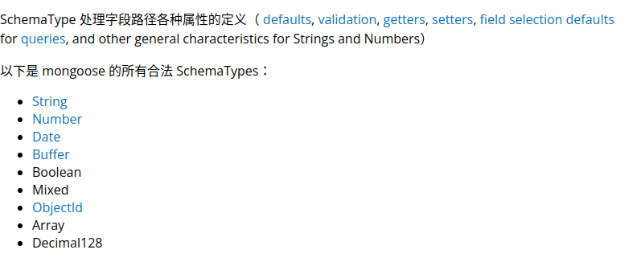

# mongoose使用

1）

2）

3）创建一个schema:

const schema={

name:string,

age:number,

health:string

}

mongoose有自己的数据类型

4)创建一个model:

const cat = mongoose.model('cat',schema);

5)写入数据库

kitty1.save()

写入后数据集的名称：是定义model的第一个参数，并且进行修改，保证是英文的复数形式

6）数据查找

数据集.find({查询条件}，callback(err,查询结果)=>{})

model名.find({查询条件},callback(err,查询结果)=>{})

查询结果是一个array,data[0]._doc是查询出的文档